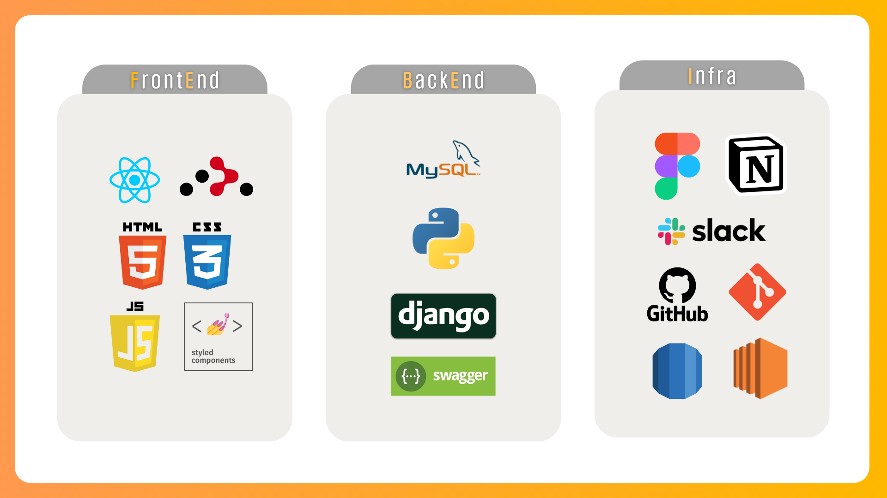

# 🐶 Meong Signal

> Team 감자탕후루 |
> 김시원 김애리 백세희 유승인 이영주

 
더 건강하개, 더 재미있개! 

### [🛠️멍 시그널 배포 링크 바로가기](https://meong-signal.o-r.kr)

### [🎬멍 시그널 홍보 영상 바로가기](https://youtu.be/4Iq38YWdS-4?si=wcxGkzFkustVEiyr)

 

### 📂 Content

- [🔎 기술 스택](#기술-스택)
- [🔎 서비스 고안 배경](#서비스-고안-배경)
- [🔎 서비스 매커니즘](#서비스-매커니즘)
- [🔎 주요 기능](#주요-기능)
- [🔎 상세 기능](#상세-기능)
- [🔎 서버 아키텍처](#서버-아키텍처)
- [🔎 와이어프레임](#와이어프레임)
- [🔎 데이터베이스 구조](#데이터베이스-구조--erd-diagram)
- [🔎 api 명세](#api-명세)
- [🔎 개발 과정](#개발-과정)
- [🔎 팀 소개](#팀-소개)

 

## 🛠️기술 스택

 

> 프론트엔드 (FrontEnd)

- React
- HTML5
- CSS
- JavaScript
- 스타일링: Styled-Components
- 포매터: ESLint + Prettier
- 라우팅: React Router
- HTTP 클라이언트: Axios

> 백엔드 (BackEnd)

- Django

> 데이터베이스 관리 (Database Management)

- AWS RDS (MySQL)

> 서버 배포 (Server Deployment)

- AWS EC2

> 협업 툴 (Collaboration Tools)

- Notion
- Slack
- Git
- GitHub
- Figma

 

## 🌟서비스 고안 배경

대개 견주들은 바쁘거나, 일정이 존재하여 강아지를 산책시킬 시간을 내기 어려울 때가 종종 있습니다.
이에 따라 일정의 보수를 받고 강아지를 대신 산책시켜주는 '도그워커'가 등장하기도 하였습니다.

그러나 보수가 목적이 아닌 단순 강아지와 함께 산책을 하고자 하는 일반인도 존재하며, 이러한 무보수 도그워커까지 폭넓게 포함하여
견주와 도그워커를 매칭해주는 서비스가 있다면 편리할 것입니다.

산책자는 혼자 하는 산책보다 더 즐거운 시간을 보낼 수 있고, 귀여운 강아지와의 교감을 통해 더욱 특별한 추억을 만들 수 있습니다. 견주들은 강아지가 충분히 운동하고 행복하게 산책할 수 있어서 안심할 수 있죠!

또한, 단순 산책 뿐만 아니라 앱 내 다양한 재미요소와 미션을 걸어 산책의 즐거움을 사용자에게 체험하게함으로써, 다각적인 방면에서의 건강을 증진시키는 것을 기대합니다.
 

## 🔗서비스 매커니즘

(간략하게 주요 서비스 매커니즘 설명)
 

## 🔔주요 기능

  
**사용자 위치 기반 지도**

- 도그워커의 현재 위치를 기반으로 주변의 강아지 정보를 불러옵니다.
- 견주의 집 위치를 기반으로 강아지 정보를 생성합니다.
- 도그워커가 견주의 강아지와 산책 중일 때, 견주는 도그워커의 현재 위치를 원격으로 볼 수 있습니다.
- 도그워커가 이동한 경로가 지도에 표시되며, 이동 거리와 소모 칼로리가 계산됩니다.

**실시간 채팅**

- 도그워커가 지도에서 강아지의 정보를 확인하고, 견주와 채팅을 시작할 수 있습니다.
- 채팅방 안에서 날짜와 시간, 약속명을 설정하여 약속을 생성할 수 있습니다.
- 채팅방 목록에서 곧 다가오는 산책 약속을 확인할 수 있습니다.

  **다양한 재미요소**

- 다양한 업적을 달성하고, 칭호를 획득할 수 있습니다. 칭호는 당신의 이름을 더욱 빛내줄거에요!
- 강아지와 산책하는 것만으로 챌린지를 달성하고, 재화를 획득할 수 있습니다. 획득한 재화는 물건 구매나 리뷰 작성 시 상대방에게 선물할 수 있습니다.
- 산책 기록 데이터를 통해 내가 얼마나 산책했는지 확인할 수 있습니다.

 

## ✨상세 기능

> 소셜로그인 | 일반적인 회원가입 외에 카카오톡, 구글, 네이버로 소셜 로그인을 진행할 수 있습니다.
>
> 리뷰 | 산책이 끝난 후 도그워커와 견주 간 상호 리뷰를 남길 수 있고, 멍 선물도 가능합니다.
>
> 강아지 태그 필터링 | 견주가 강아지 정보를 입력할 때 등록한 강아지 성격 태그로, 특정 성격의 강아지를 지도에서 필터링할 수 있습니다.
>
> 산책 정보 제공 | 지금까지의 산책 내역, 산책 추이 그래프, 산책 별 이동 거리, 소모 칼로리 등 다양한 정보를 확인할 수 있습니다.
>
> 업적 | 거리 이동형, 산책 횟수형과 같은 업적을 달성해 칭호를 획득할 수 있습니다.
>
> 챌린지 | 설정된 주간 챌린지를 달성하여 앱 내에서 사용 가능한 재화, '멍'을 획득할 수 있습니다.
>
> 약속 | 견주 - 도그워커 간에 맺어진 약속은 양측에서 모두 확인 가능하며, 조회, 수정, 취소가 가능합니다.
>
> 추천 경로 | 한국문화정보원에서 제공하는 내 위치 주변의 추천 산책로를 확인 및 저장할 수 있습니다.

## 🧱서버 아키텍처

 

## 💎와이어프레임

 

## 🗃️데이터베이스 구조 | ERD Diagram

  

## ⛓️api 명세

### [🛠️멍 시그널 기능명세 노션 링크](https://abyss-2.notion.site/e607658be211483a9aa4f76c5e8223c2?pvs=4)

## 💻개발 과정

(슬라이드 제작해서 첨부)
  

## 😎팀 소개

멋쟁이사자처럼 인하대학교 12기 중앙 해커톤 1팀, 감자탕후루 팀입니다.

| 김시원                                   | 김애리                               | 백세희                                 | 유승인                                           | 이영주                                 |
| ---------------------------------------- | ------------------------------------ | -------------------------------------- | ------------------------------------------------ | -------------------------------------- |
| BE                                       | FE                                   | BE                                     | FE                                               | FE                                     |
| [@seaniiio](https://github.com/seaniiio) | [@aeli22](https://github.com/aeli22) | [@sae2say](https://github.com/sae2say) | [@seung-in-Yoo](https://github.com/seung-in-Yoo) | [@abyss-s](https://github.com/abyss-s) |
